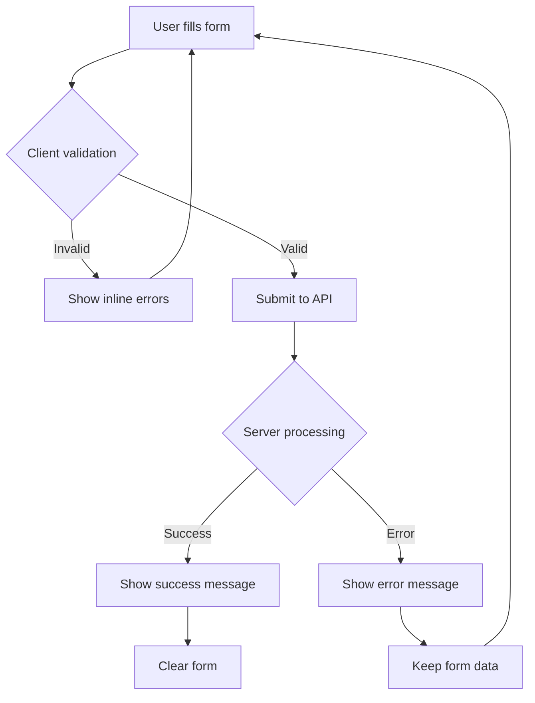

# Event Submission Feature - Implementation Plan

## Overview
Add functionality to allow users to submit events directly from the contact page, with automatic publishing to the Supabase database.

## Requirements
- **Auto-publish**: Events are immediately published without admin approval
- **Required fields**: title, description, date, location
- **Optional fields**: price, currency, registration URL, organizer
- **Auto-detection**: Category and language are automatically detected
- **User experience**: Clean form with validation and feedback

## Architecture

### 1. API Endpoint: `/api/events/submit`

**File**: `app/api/events/submit/route.ts`

**Responsibilities**:
- Accept POST requests with event data
- Validate required fields (title, description, date_time, location)
- Auto-detect category using [`categorizeEvent()`](lib/scraper-utils.ts)
- Auto-detect language using [`detectLanguage()`](lib/scraper-utils.ts)
- Set default values for optional fields
- Store event using [`eventService.createEvent()`](lib/supabase.ts:67)
- Return success/error response

**Request Schema**:
```typescript
{
  title: string;           // Required
  description: string;     // Required
  date_time: string;       // Required (ISO 8601)
  location: string;        // Required
  price?: number;          // Optional (default: 0)
  currency?: string;       // Optional (default: 'CHF')
  registration_url?: string; // Optional
  organizer?: string;      // Optional
}
```

**Response Schema**:
```typescript
{
  success: boolean;
  event?: Event;           // On success
  error?: string;          // On failure
}
```

### 2. Contact Page Enhancement

**File**: `app/contact/page.tsx`

**Changes**:
- Convert from server component to client component (`'use client'`)
- Add React state for form management
- Replace static "Submit Your Event" section with interactive form
- Implement form validation
- Add loading states and error handling
- Show success/error notifications

**Form Fields**:

**Required**:
- Title (text input)
- Description (textarea)
- Date & Time (datetime-local input)
- Location (text input)

**Optional**:
- Price (number input with currency selector)
- Registration URL (url input)
- Organizer (text input)

**Form States**:
- `formData`: Object containing all form field values
- `errors`: Object containing validation errors per field
- `isSubmitting`: Boolean for loading state
- `submitStatus`: 'idle' | 'success' | 'error'
- `submitMessage`: String for user feedback

### 3. Validation Rules

**Client-side**:
- Title: 3-200 characters
- Description: 10-2000 characters
- Date: Must be in the future
- Location: 3-200 characters
- Price: >= 0 if provided
- Registration URL: Valid URL format if provided

**Server-side**:
- Same validations as client-side
- Additional sanitization of inputs
- Date format validation (ISO 8601)

### 4. User Experience Flow



## Implementation Steps

### Step 1: Create API Endpoint
1. Create `app/api/events/submit/route.ts`
2. Implement POST handler with validation
3. Use existing [`categorizeEvent()`](lib/scraper-utils.ts) and [`detectLanguage()`](lib/scraper-utils.ts)
4. Call [`eventService.createEvent()`](lib/supabase.ts:67)
5. Handle errors gracefully

### Step 2: Update Contact Page
1. Add `'use client'` directive
2. Import React hooks (useState)
3. Create form state management
4. Build event submission form UI
5. Implement client-side validation
6. Add form submission handler
7. Display success/error feedback

### Step 3: Testing
1. Test with valid data
2. Test with invalid data (missing fields, wrong formats)
3. Test with optional fields
4. Test error scenarios (network errors, database errors)
5. Verify events appear in database
6. Verify auto-categorization works correctly

## Technical Considerations

### Security
- Server-side validation is mandatory (never trust client)
- Sanitize all inputs to prevent XSS
- Rate limiting may be needed in production

### Data Defaults
- `price`: 0 (free event)
- `currency`: 'CHF'
- `is_featured`: false
- `capacity`: null
- `attendees_count`: 0
- `tags`: [] (empty array)
- `image_url`: null

### Error Handling
- Network errors: Show user-friendly message
- Validation errors: Show specific field errors
- Database errors: Log server-side, show generic message to user

### Accessibility
- Proper form labels
- ARIA attributes for error messages
- Keyboard navigation support
- Focus management

## Files to Create/Modify

### New Files
- `app/api/events/submit/route.ts` - API endpoint

### Modified Files
- `app/contact/page.tsx` - Add event submission form

### Existing Files Used
- [`lib/supabase.ts`](lib/supabase.ts) - [`eventService.createEvent()`](lib/supabase.ts:67)
- [`lib/scraper-utils.ts`](lib/scraper-utils.ts) - [`categorizeEvent()`](lib/scraper-utils.ts), [`detectLanguage()`](lib/scraper-utils.ts)
- [`lib/types.ts`](lib/types.ts) - Event type definitions

## Success Criteria
- ✅ Users can submit events from contact page
- ✅ Events are immediately visible in events list
- ✅ Form validation prevents invalid submissions
- ✅ Clear feedback on success/error
- ✅ Category and language are auto-detected correctly
- ✅ Optional fields work as expected
- ✅ Form is accessible and user-friendly